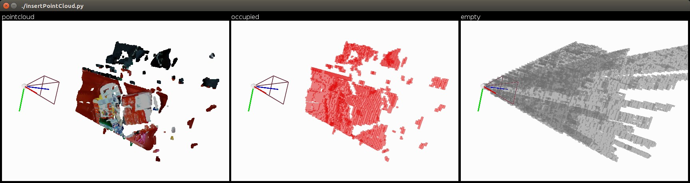

# octomap-python

[](https://pypi.python.org/pypi/octomap-python)
[](https://pypi.org/project/octomap-python)
[](https://travis-ci.com/wkentaro/octomap-python)


Python binding of [the OctoMap library](https://github.com/OctoMap/octomap).


## Installation

```bash
pip install octomap-python
```


## Example

```bash
git clone --recursive https://github.com/wkentaro/octomap-python.git && cd octomap-python
pip install -e '.[example]'

cd examples
python insertPointCloud.py
```




## Acknowledgement

This is a fork of [neka-nat/python-octomap](https://github.com/neka-nat/python-octomap).
