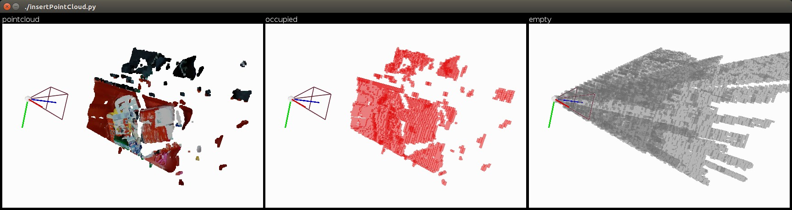

# octomap-python

[](https://pypi.org/project/octomap-python/)
[](https://pypi.org/project/octomap-python/)
[](https://github.com/wkentaro/octomap-python/actions/workflows/ci.yml)
[](https://pypi.org/project/octomap-python/)

Python binding of [OctoMap](https://github.com/OctoMap/octomap), the 3D
occupancy mapping library.

OctoMap builds a probabilistic 3D occupancy map (an octree) from point clouds:
you stream in sensor measurements and query whether any point in space is
occupied, free, or still unknown. This package exposes that C++ library to
Python with NumPy arrays as the interchange format, so point clouds and queries
are plain `np.ndarray`s.



## Install

```bash
pip install octomap-python
```

Or with [uv](https://docs.astral.sh/uv/):

```bash
uv add octomap-python
```

Binary wheels are published for Linux (x86_64, aarch64) and macOS (Apple
Silicon), CPython 3.9-3.13. Windows and other platforms build from the sdist
and need a C++ compiler.

## Quick start

```python
import numpy as np
import octomap

# Resolution is the smallest voxel edge length, in meters.
octree = octomap.OcTree(0.1)

# Insert a point cloud measured from a sensor at `origin`.
points = np.random.uniform(-1, 1, size=(1000, 3))
octree.insertPointCloud(
    pointcloud=points,
    origin=np.array([0.0, 0.0, 0.0]),
)

# Query a coordinate: occupied / free / unknown (never observed).
node = octree.search(points[0])
try:
    print("occupied" if octree.isNodeOccupied(node) else "free")
except octomap.NullPointerException:
    print("unknown")

# Bounding box of everything mapped so far.
print(octree.getMetricMin(), octree.getMetricMax())

# Persist to / restore from the OctoMap binary format.
octree.writeBinary("tree.bt")
restored = octomap.OcTree(0.1)
restored.readBinary("tree.bt")
```

## Examples

Runnable demos live in [`examples/`](examples); the teaser above is
`insertPointCloud.py`:

```bash
git clone --recursive https://github.com/wkentaro/octomap-python.git
cd octomap-python
uv sync --group examples

cd examples
uv run python insertPointCloud.py
```

## Release

Releases are published to PyPI by the `publish` workflow, which fires when a
GitHub Release is published. It builds the wheel matrix + sdist and uploads via
[PyPI Trusted Publishing](https://docs.pypi.org/trusted-publishers/) (OIDC, no
stored token).

To cut a release:

1. Bump `version` in `pyproject.toml` to match the new tag and commit it.
2. Create a GitHub Release with tag `vX.Y.Z` (e.g. `v1.8.0.post13`).
3. The `publish` workflow runs and uploads the built distributions to PyPI.

## Acknowledgement

This is a fork of
[neka-nat/python-octomap](https://github.com/neka-nat/python-octomap).

## License

BSD-3-Clause ([LICENSE](https://github.com/wkentaro/octomap-python/blob/main/LICENSE))
